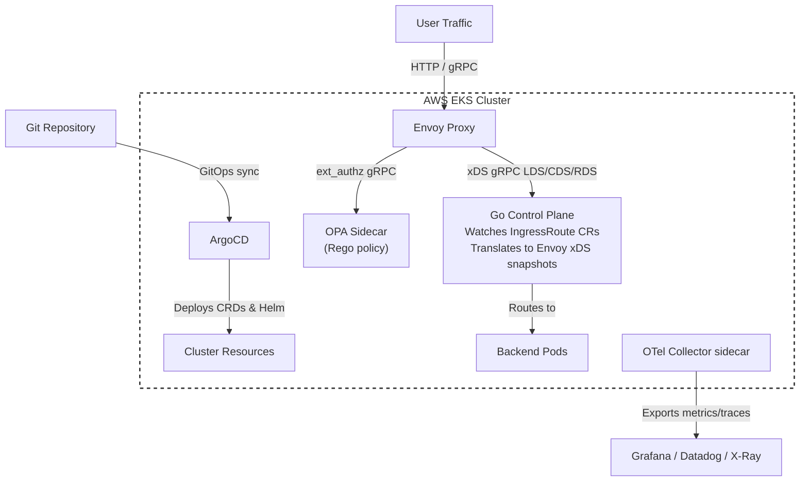

# Ingress Control Plane Engine

A production-grade, multi-tenant **Unified Ingress Control Plane & Gateway Engine** built for AWS EKS. It bridges the gap between developer-committed GitOps manifests and low-level Envoy proxy configuration, enforcing Zero-Trust security policies in real-time with no proxy restarts required.

---

## Architecture: Unified Ingress Control Plane


### Component Responsibilities

| Component | Role |
|---|---|
| **Go Control Plane** | Kubernetes controller watching `IngressRoute` CRs; pushes complete xDS v3 snapshots to Envoy via gRPC |
| **Envoy Proxy** | Data-plane gateway; receives routing config dynamically over xDS; enforces auth via `ext_authz` |
| **OPA Sidecar** | Evaluates Rego policies in response to Envoy `ext_authz` gRPC calls; validates JWT, roles, and SPIFFE identities |
| **ArgoCD** | GitOps engine; reconciles all cluster resources against the `main` branch continuously |
| **OTel Collector** | Aggregates traces and metrics from Envoy and the controller; forwards to the configured observability backend |

---

## Repository Layout

```
ingress-control-plane-engine/
├── apps/
│   ├── crds/
│   │   └── ingressroute-crd.yaml       # IngressRoute CRD definition
│   └── templates/
│       └── sample-ingressroute.yaml    # Example IngressRoute declarations
├── cmd/
│   └── controller/
│       └── main.go                     # Entry point: wires manager, xDS, reconciler
├── pkg/
│   ├── controller/
│   │   └── reconciler.go               # Kubernetes reconcile loop (controller-runtime)
│   ├── xds/
│   │   ├── server.go                   # xDS gRPC server + SnapshotCache
│   │   └── resources.go                # Envoy LDS / CDS / RDS resource builders
│   └── opa/
│       └── policy.rego                 # Rego authorization policy bundle
├── deploy/
│   ├── argocd/
│   │   ├── root-app.yaml               # App-of-Apps root manifest
│   │   └── apps/
│   │       └── controller-app.yaml     # Child applications (CRDs + Helm chart)
│   └── helm/
│       ├── Chart.yaml
│       ├── values.yaml
│       ├── envoy-bootstrap.yaml        # Envoy node bootstrap config
│       └── templates/
│           ├── _helpers.tpl
│           ├── controller-deployment.yaml
│           ├── controller-service.yaml
│           ├── controller-rbac.yaml
│           ├── envoy-deployment.yaml
│           ├── envoy-service.yaml
│           ├── envoy-configmap.yaml
│           ├── hpa.yaml
│           ├── pdb.yaml
│           └── networkpolicy.yaml
├── Dockerfile
├── Makefile
└── README.md
```

---

## Tech Stack

| Layer | Technology |
|---|---|
| Orchestration | Kubernetes on AWS EKS v1.31 |
| Data Plane | Envoy Proxy v1.30 (xDS v3, ext_authz, gRPC, HTTP/2) |
| Control Plane | Go 1.22, client-go, controller-runtime v0.17, go-control-plane v0.12 |
| Security | OPA v0.65 (Rego), JWT validation, SPIFFE/mTLS |
| GitOps | ArgoCD — App-of-Apps pattern |
| Observability | OpenTelemetry Collector, Envoy stats, structured JSON logs |
| High Availability | HPA, PodDisruptionBudgets, leader election, NetworkPolicies |

---

## Quick Start

### Prerequisites

- Go 1.22+
- Docker
- kubectl configured against an EKS cluster
- Helm 3.14+
- ArgoCD installed in the `argocd` namespace

### 1. Apply the CRD

```bash
kubectl apply -f apps/crds/ingressroute-crd.yaml
kubectl wait --for condition=established --timeout=60s \
  crd/ingressroutes.platform.internal
```

### 2. Install via Helm (direct, non-GitOps)

```bash
make helm-install
```

Or with overrides:

```bash
helm upgrade --install icpe deploy/helm \
  --set controller.image.tag=1.0.0 \
  --set envoy.service.type=LoadBalancer \
  --namespace default --create-namespace
```

### 3. Deploy via ArgoCD (GitOps path)

```bash
# Update the repoURL in deploy/argocd/root-app.yaml to your fork first
make deploy
```

ArgoCD will automatically sync the CRDs and Helm chart from the `main` branch.

### 4. Declare a route

```bash
kubectl apply -f apps/templates/sample-ingressroute.yaml
```

The controller detects the new `IngressRoute` within seconds, rebuilds the xDS snapshot, and pushes the updated route to Envoy — no proxy restart needed.

### 5. Test routing and authorization

```bash
# Resolve the Envoy LoadBalancer IP
ENVOY_IP=$(kubectl get svc icpe-envoy -o jsonpath='{.status.loadBalancer.ingress[0].hostname}')

# Unauthorized request -- should return HTTP 403
curl -i http://${ENVOY_IP}/api/v1/orders

# Authorized request -- JWT must carry role: platform-admin, developer, etc.
curl -i -H "Authorization: Bearer <VALID_JWT>" http://${ENVOY_IP}/api/v1/orders

# Health check (no auth required)
curl -i http://${ENVOY_IP}/healthz
```

---

## IngressRoute CRD Reference

```yaml
apiVersion: platform.internal/v1alpha1
kind: IngressRoute
metadata:
  name: my-api-route
  namespace: default
spec:
  prefix: /api/v1/orders          # URL path prefix (required, must start with /)
  serviceName: order-service      # Kubernetes Service name (required)
  servicePort: 8080               # Service port (required, 1-65535)
  authRequired: true              # Enable OPA ext_authz for this route (default: false)
  timeoutMs: 10000                # Route timeout in ms, 0 = disabled (default: 15000)
  retryPolicy:
    numRetries: 3                 # Number of retry attempts (default: 2)
    perTryTimeoutMs: 3000         # Per-attempt timeout in ms (default: 5000)
  rateLimit:
    requestsPerUnit: 500
    unit: MINUTE                  # SECOND | MINUTE | HOUR
```

---

## OPA Authorization Policy

The Rego policy at `pkg/opa/policy.rego` evaluates every request intercepted by Envoy's `ext_authz` filter. A request is **allowed** if any of the following is true:

1. The `Authorization: Bearer <token>` header contains a valid (non-expired) JWT whose `roles` claim includes at least one of: `platform-admin`, `service-account`, `developer`, `readonly`
2. The request path starts with `/healthz` or `/readyz`
3. The mTLS SPIFFE identity of the source pod matches a trusted namespace prefix (`platform`, `default`, `commerce`)

For routes with `authRequired: false`, Envoy bypasses the `ext_authz` filter entirely via per-route typed filter config — OPA is never called.

---

## Observability

The OTel Collector sidecar (enabled by default) exposes:

- **Traces**: OTLP gRPC on port 4317 — forwarded to the configured `otelCollector.otlpEndpoint`
- **Metrics**: Scraped from Envoy admin `/stats/prometheus` on port 9901 every 15 seconds
- **Logs**: Structured JSON from the Go controller on stdout; decision logs from OPA on stdout

Configure the exporter endpoint in `values.yaml`:

```yaml
otelCollector:
  otlpEndpoint: "http://otel-collector.observability.svc.cluster.local:4317"
```

---

## High Availability

| Mechanism | Config key | Default |
|---|---|---|
| Controller replicas | `controller.replicaCount` | 2 |
| Envoy replicas | `envoy.replicaCount` | 2 |
| Controller HPA | `controller.hpa.*` | CPU 70%, Mem 80%, max 10 |
| Envoy HPA | `envoy.hpa.*` | CPU 60%, max 20 |
| Controller PDB | `controller.pdb.minAvailable` | 1 |
| Envoy PDB | `envoy.pdb.minAvailable` | 1 |
| Leader election | `controller.leaderElection` | true |

---

## Development

```bash
# Run locally against a cluster (requires a valid kubeconfig)
go run ./cmd/controller \
  --xds-addr=:18000 \
  --metrics-addr=:8080 \
  --probe-addr=:8081 \
  --log-level=debug \
  --leader-elect=false

# Run tests
make test

# Lint
make lint

# Validate OPA policy syntax
make opa-check

# Build Docker image
make docker-build IMAGE_TAG=local

# Full help
make help
```

---

## Security Considerations

- Controller pods run as non-root (`runAsUser: 1000`) with a read-only root filesystem
- Envoy container drops all Linux capabilities
- NetworkPolicies restrict pod-to-pod traffic to only necessary paths
- OPA runs with `failureModeAllow: false` by default — if OPA is unreachable, Envoy rejects requests
- TLS for the xDS gRPC channel should be enabled in production using cert-manager; the bootstrap config supports it via `upstreamTlsContext`
- IRSA (IAM Roles for Service Accounts) is supported via `controller.serviceAccount.annotations`
